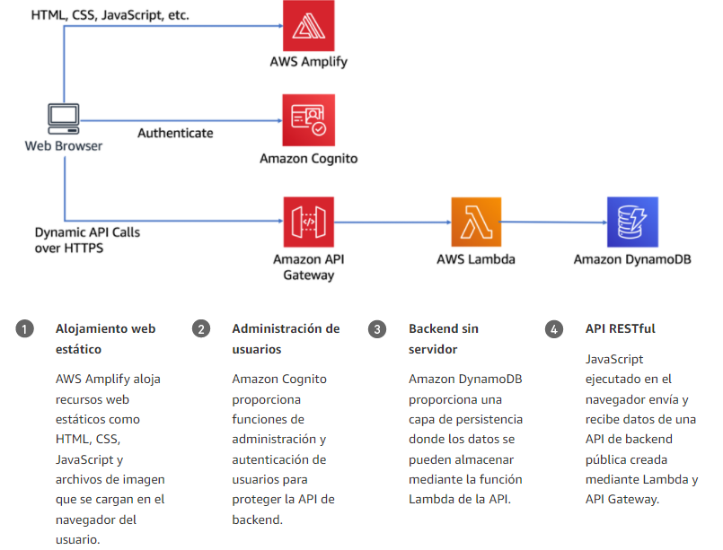
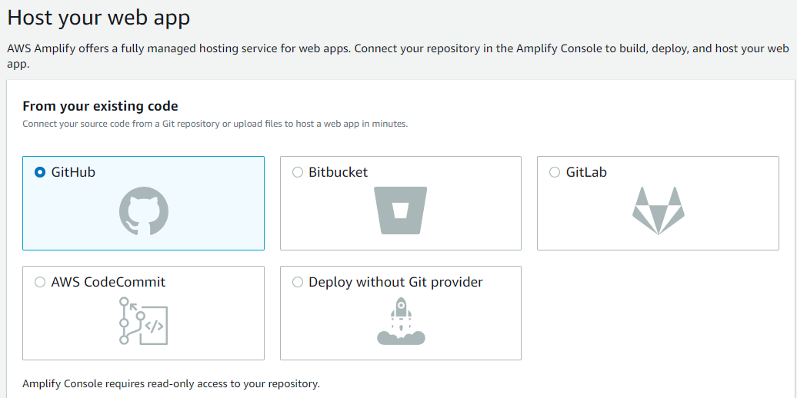
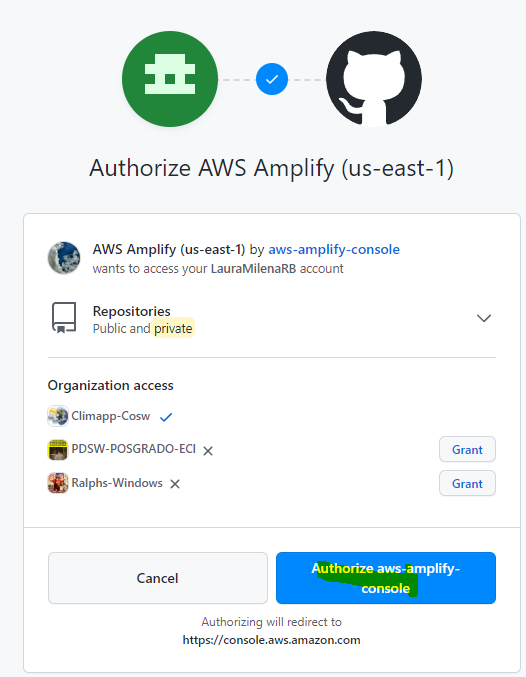

# Security Homework

1. Desarrolle uno de los talleres propuestos y complete un proyecto de Github detallando sus resultados. 
2. Agregue evidencia en el archivo README que muestre la implementación y sus pruebas. El taller elegido es AWS Serverless Application Model.

##Prerequisitos
1. Crear una cuenta de AWS.
2. Tener Git
3. Instalar AWS CLI
##Arquitectura propuesta
La arquitectura de la aplicación utiliza AWS Lambda, Amazon API Gateway, Amazon DynamoDB, Amazon Cognito y la consola de AWS Amplify.

###Funcionalidades
* La aplicación web sin servidor permite a los usuarios solicitar paseos en unicornio de la flota de Wild Rydes. 
* La aplicación tiene una interfaz basada en HTML para indicar la ubicación en la que desean que se les recoja e interactuará con un servicio web RESTful para enviar la solicitud y enviar un unicornio cercano. 
* También permitirá a los usuarios registrarse al servicio e iniciar sesión antes de solicitar paseos.

##1. Alojamiento web estático con implementación continua.
1. Luego de seleccionar,crear y clonar el repositorio habilite el alojamiento web con AWS Amplify.

2. Autorice la cuenta de AWS con github

3. 
##2. .
##3. .
##4. .
##5.

