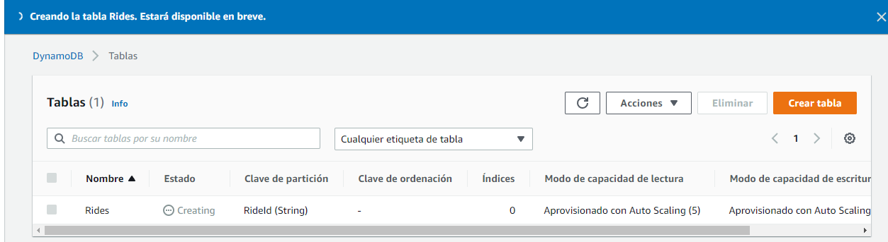

# Security Homework

1. Desarrolle uno de los talleres propuestos y complete un proyecto de Github detallando sus resultados. 
2. Agregue evidencia en el archivo README que muestre la implementación y sus pruebas. El taller elegido es AWS Serverless Application Model.

##Prerequisitos
1. Crear una cuenta de AWS.
2. Tener Git.
3. Instalar AWS CLI.
##Arquitectura propuesta
La arquitectura de la aplicación utiliza AWS Lambda, Amazon API Gateway, Amazon DynamoDB, Amazon Cognito y la consola de AWS Amplify.

###Funcionalidades
* La aplicación web sin servidor permite a los usuarios solicitar paseos en unicornio de la flota de Wild Rydes. 
* La aplicación tiene una interfaz basada en HTML para indicar la ubicación en la que desean que se les recoja e interactuará con un servicio web RESTful para enviar la solicitud y enviar un unicornio cercano. 
* También permitirá a los usuarios registrarse al servicio e iniciar sesión antes de solicitar paseos.

##1. Alojamiento web estático con implementación continua con AWS Amplify.
   1. Luego de seleccionar,crear y clonar el repositorio habilite el alojamiento web con AWS Amplify.
   
   2. Autorice la cuenta de AWS con github.
   3. Luego configure amplify para que Amplify cree los recursos de la aplicacion.
      
   4. Una vez finalizado el proceso, al hacer clic en la imagen se lanza el sitio de Wild Rydes.
      
##2. Administración de usuarios con Cognito AWS.
   1. Se crea un grupo de usuarios de Amazon Cognito
   
   2. Anote el Id de grupo generado de su grupo de usuarios.
   
   3. Luego se añade una aplicación al grupo de usuarios. Se debe asegurar que la opción Generate client secret (Generar secreto de cliente) no este seleccionada.
   
   4. Verifique el funcionamiento de su aplicación, registre un usuario nuevo.
   
   5. Si el usuario ha sido verificado o confirmado exitosamente deberia poder entrar a la aplicacion.
   
##3. Backend de servicios sin servidor con DynamoDB, AWS Lambda y Api Gateway.
   1. Se crea una tabla en DynamoDB.
    
   2. Cree un nuevo rol asociado a su funcion lambda y cree una politica asociada a el.
   
   3. Luego Creamos una funcion lambda desde cero y le asociamos el rol existente *'WildRydesLambda'*.
   
##4. Implementar una API RESTful con Api Gateway
   1. Cree la api REST con AWS Api Gateway y cree un autorizador de grupos de usuario con cognito.
   
   2. Cree un nuevo recurso y metodo POST.
   
   
   3. Por ultimo valide la implementación.
   

